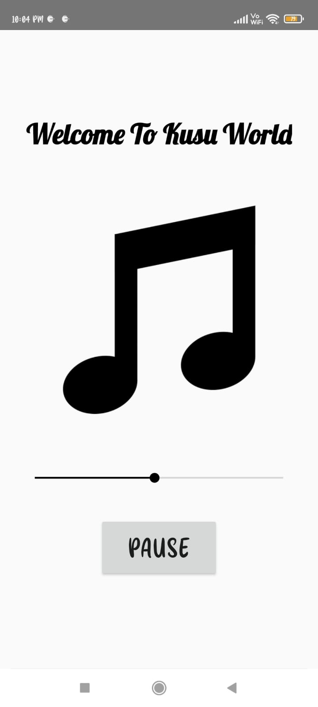
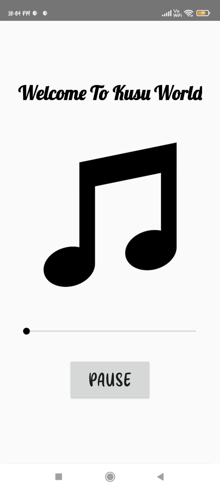

# Kusu-World-ANDROID-APP :star_struck: 

[](https://shields.io/) [](https://shields.io/) [](https://shields.io/) [](https://shields.io/) [](https://shields.io/) [](https://shields.io/) [](https://shields.io/) [](https://shields.io/) 

***This new android application named 'Kusu-World-APP' is created by Biswarup Bhattacharjee, student of BTECH, in University of Engineering and Management, Kolkata.***

**Email Id: bbiswa471@gmail.com.** 

**Contact No: 916290272740.** 

<p align="left">
<a href="https://www.facebook.com/profile.php?id=100070395300810" target="blank"></a>
<a href="https://instagram.com/biswarup2210" target="blank"></a>
<a href="https://github.com/biswa2210/biswa2210" target="blank"></a>
</p>

## About :point_down: 

<div align="justified">
 
This is a basic java app kusu world which plays a bollywood hit song 'Kusu Kusu'. Basically it is a practice of media playing in android app. Here we can play or pause the song.
 
</div>

## APP DOWNLOAD LINK : :point_right: <a href="https://drive.google.com/file/d/1-d9phzoCA7nJEG6GF4nvKNvUSvcOCkah/view" download>Click here to download</a>

## Purpose :point_down:

<div align="justified">
       
I have made this app to practice media playing in android app.
 
</div>

## Folder Structure :point_down:
```bash
kg-to-lb-app
      └── app
           └── src
                ├──android/java/com/example/kusuworld
                |                             └── ExampleInstrumentedTest.java
                ├── test/java/com/example/kusuworld
                |                             └── ExampleUnitTest.java
                └── main
                      └── java/com/example/kusuworld
                                     └── MainActivity.java  
 ```                               
## Making :point_down:

<div align="justified">

I have made this app using java by implementing media mp3 playing in android app.

</div>


## Screenshots :point_down: 

<div align="center">
  
<a href="pics/us1.jpeg"></a> <a href="pics/us2.jpeg"></a> <a href="pics/us3.jpeg"></a>
       
</div>


