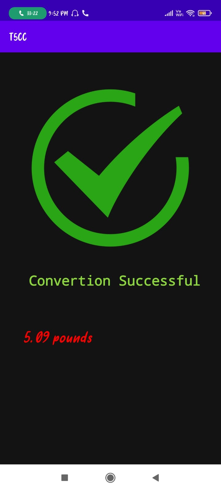
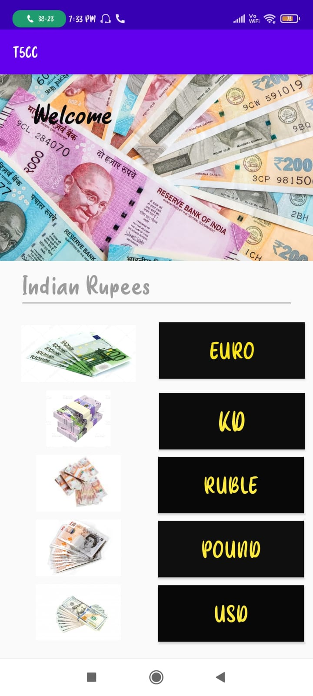
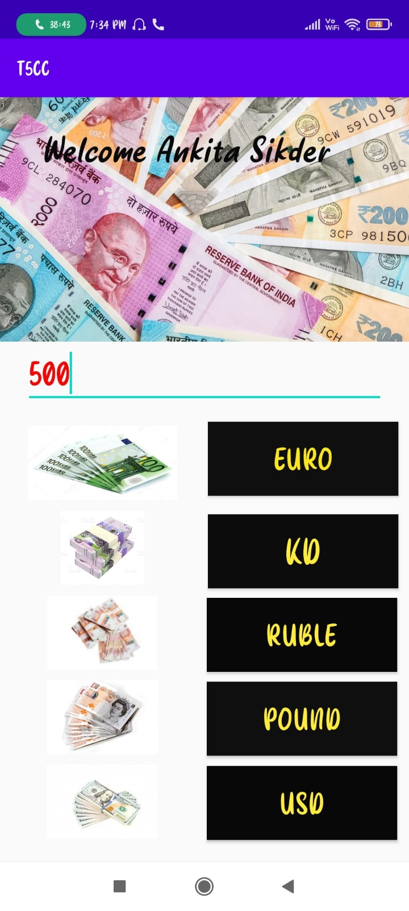

# T5CC-ANDROID-APP :star_struck: 

[](https://shields.io/) [](https://shields.io/) [](https://shields.io/) [](https://shields.io/) [](https://shields.io/) [](https://shields.io/) [](https://shields.io/) [](https://shields.io/) 

***This new android application named 'T5CC-ANDROID-APP' is created by Biswarup Bhattacharjee, student of BTECH, in University of Engineering and Management, Kolkata.***

**Email Id: bbiswa471@gmail.com.** 

**Contact No: 916290272740.** 

<p align="left">
<a href="https://www.facebook.com/profile.php?id=100070395300810" target="blank"></a>
<a href="https://instagram.com/biswarup2210" target="blank"></a>
<a href="https://github.com/biswa2210/biswa2210" target="blank"></a>
</p>

## What is Currency Converter :point_down: 

<div align="justified">
 
It is essentially the price measure of one currency against another. As the rate changes, one country's money can become weaker or stronger against other currencies.

</div>

## About :point_down: 

<div align="justified">
 
This is a currency converter android application. It converts Indian Rupees to EURO, KD, RUBLE, POUND AND USD. Here first of all we have to enter a name. Then we have to enter a valid amount of Indian Rupees. Then we hve to click on a button among the following. Then we will get the converted amount. The onverted amount is correct. This app is very user-friendly and it works perfectly.

</div>

## APP DOWNLOAD LINK : :point_right: <a href="https://drive.google.com/file/d/1-GtNvefStfPVAzBncTeZA6izQpK8OEi2/view" download>Click here to download</a>

## Purpose :point_down:

<div align="justified">
       
I have made this top 5 currency converter android aplication so that we can easily use our phone to convert Indian Rupees to top 5 currencies EURO, KD, RUBLE, POUND AND USD.
       
</div>
       
## Importance :point_down:

<div align="justified">

An exchange rate is known as a rate whereby a certain currency could be exchanged or traded using another currency. There are people who use a currency converter so that they could keep track of the rates they exchange in an easier and more systematic manner.Nowadays, there are many currency converters that could be found online that even have real-time conversions for different currencies.  This makes it easier for the foreign exchange traders to figure out the effective rate that they should be expecting at the end of the trading day.  When checking out the exchange rates, it is important to know the different options that one has before actually and finally doing the trading.Using a currency converter is quite easy to do and understand.  These converters are very handy because they could show the fluctuation of the rates in real time.  When it comes to foreign exchange, people have to find the best option available for them.  Each strategy and technique of foreign exchange has its own set of pros and cons, so people who wish to convert their money from one currency to another should be well-versed of which one would give them the best rates and which would be the most beneficial for them.  Each foreign exchange trading platform has its own currency converter and they may also put on extra fees for the people who exchange currencies, so it is best to aware of these things.
       
</div>

## Folder Structure :point_down:

```bash
t5cc-android-app
      └── app
           └── src
                └── main
                      └── java/com/example/t5cc
                                     ├── conversionactivity.java
                                     ├── successfulconversion.java
                                     └── MainActivity.java
 ```   
 
## Making :point_down:

<div align="justified">

I have created main 1 java files to create this android app. I have created MainActivity.java, conversionactivity.java, successfulconversion.java and created some logics for implementation of this app. For conversion I have used the logics. 
 
</div>


## Screenshots :point_down: 

<div align="center">
  
<a href="pics/cc1.jpeg"></a> <a href="pics/c2.jpeg"></a> <a href="pics/cc3.jpeg"></a>
       
<a href="pics/cc4.jpeg"></a> <a href="pics/cc5.jpeg"></a> <a href="pics/cc6.jpeg"></a>
 
<a href="pics/cc7.jpeg"></a> <a href="pics/c8.jpeg"></a> <a href="pics/c9.jpeg"></a>
 
</div>


