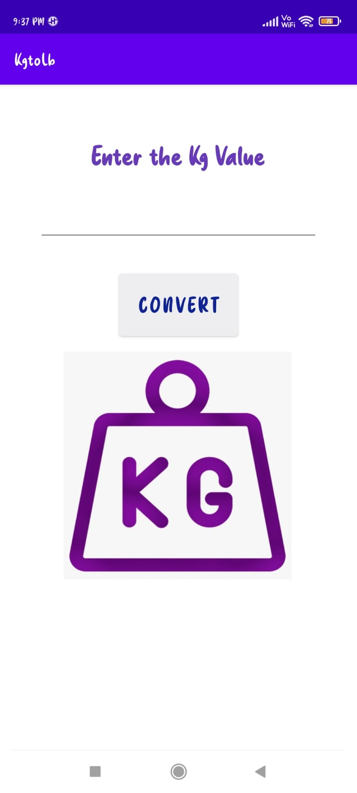
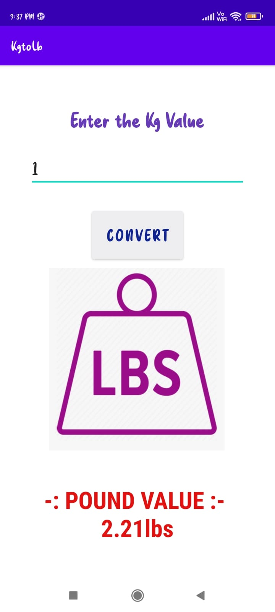
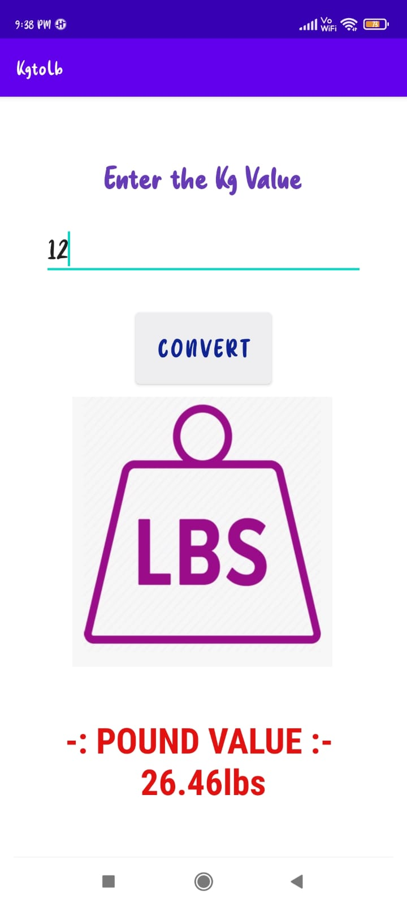

# KGtoLB-ANDROID-APP :star_struck: 

[](https://shields.io/) [](https://shields.io/) [](https://shields.io/) [](https://shields.io/) [](https://shields.io/) [](https://shields.io/) [](https://shields.io/) [](https://shields.io/) 

***This new android application named 'KGtoLB-APP' is created by Biswarup Bhattacharjee, student of BTECH, in University of Engineering and Management, Kolkata.***

**Email Id: bbiswa471@gmail.com.** 

**Contact No: 916290272740.** 

<p align="left">
<a href="https://www.facebook.com/profile.php?id=100070395300810" target="blank"></a>
<a href="https://instagram.com/biswarup2210" target="blank"></a>
<a href="https://github.com/biswa2210/biswa2210" target="blank"></a>
</p>

## About :point_down: 

<div align="justified">
 
This is a kg to lb convertion android app made using java. Kg and Lb are units of measure. We know 1 kg equals to 2.21 lbs or pounds. In this app we have to give input in kg then we have to click on the 'CONVERT' button. Then the value in pounds or lbs will be shown. This app is very useful and user-friendly. It shows the result very efficiently.

</div>

## APP DOWNLOAD LINK : :point_right: <a href="https://drive.google.com/file/d/1R4v0CufmuiJ0lWQBToryT9fL7Oyu_JNY/view" download>Click here to download</a>

## Purpose :point_down:

<div align="justified">
       
I have mad this kg to lb app to practice logic based app development and for conversion of values from kg to lbs.
 
</div>
       
## Importance :point_down:

<div align="justified">

A kg to lbs converter app always becomes useful for anyone. 

</div>

## Folder Structure :point_down:
```bash
kg-to-lb-app
      └── app
           └── src
                ├──android/java/com/example/kgtolb
                |                             └── ExampleInstrumentedTest.java
                ├── test/java/com/example/kgtolb
                |                             └── ExampleUnitTest.java
                └── main
                      └── java/com/example/kgtolb
                                     └── MainActivity.java  
 ```             
## Making :point_down:

<div align="justified">

I have made this app by implementing simple kg to lbs conversion logic using java.

</div>


## Screenshots :point_down: 

<div align="center">
  
<a href="pics/k1.jpeg"></a> <a href="pics/k2.jpeg"></a> <a href="pics/k3.jpeg"></a>
 

       
</div>


