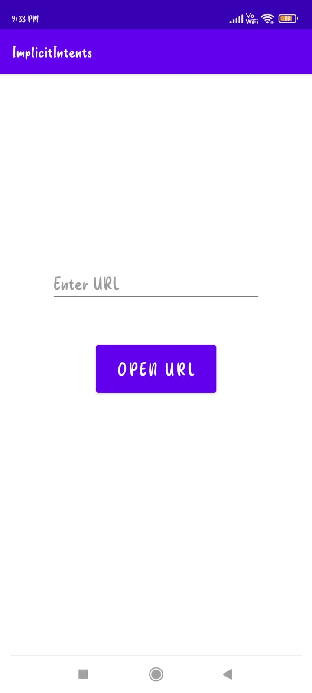
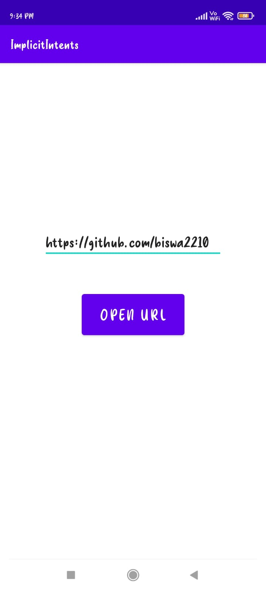
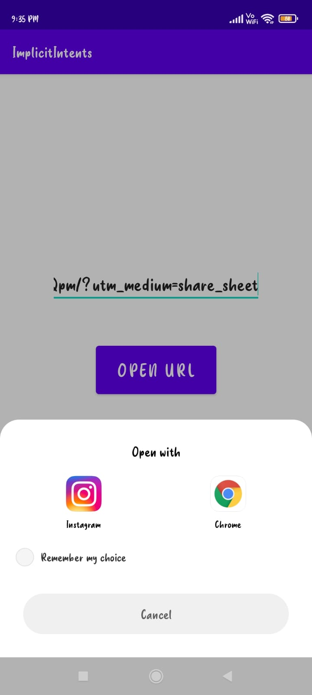

# Implecit Intents-ANDROID-APP :star_struck: 

[](https://shields.io/) [](https://shields.io/) [](https://shields.io/) [](https://shields.io/) [](https://shields.io/) [](https://shields.io/) [](https://shields.io/) [](https://shields.io/) 

***This new android application named 'Implecit-Intents-APP' is created by Biswarup Bhattacharjee, student of BTECH, in University of Engineering and Management, Kolkata.***

**Email Id: bbiswa471@gmail.com.** 

**Contact No: 916290272740.** 

<p align="left">
<a href="https://www.facebook.com/profile.php?id=100070395300810" target="blank"></a>
<a href="https://instagram.com/biswarup2210" target="blank"></a>
<a href="https://github.com/biswa2210/biswa2210" target="blank"></a>
</p>

## About :point_down: 

<div align="justified">
 
This is a basic android app created using java. Here we have to paste any valid uniform resource locator(URL) and the link can be opened by pressing 'OPEN URL' button. After clicking on it the options on that device to open that link will be shown. It is basically practice to make implecit intents in android development. This app can be used to open any url very easily. 

</div>

## APP DOWNLOAD LINK : :point_right: <a href="https://drive.google.com/file/d/1C101exAbtyeNK0P7TN9VNhsx_ON48WXx/view" download>Click here to download</a>

## Purpose :point_down:

<div align="justified">
       

 
</div>
       
## Importance :point_down:

<div align="justified">

 
</div>

## Folder Structure :point_down:
```bash
egg-timer-app
      └── app
           └── src
                └── main
                      ├── AndroidManifest.xml
                      └── java/com/example/eggtimer
                                     └── MainActivity.java  
 ```                      
## Making :point_down:

<div align="justified">

I have created main 3 java files to create this android app. I have created MainActivity.java, ExampleInstrumentedTest.java, ExampleUnitTest.java and created some logics for implementation of this app. 

</div>


## Screenshots :point_down: 

<div align="center">
  
<a href="pics/im1.jpeg"></a> <a href="pics/im2.jpeg"></a> <a href="pics/im3.jpeg"></a>
       
</div>


