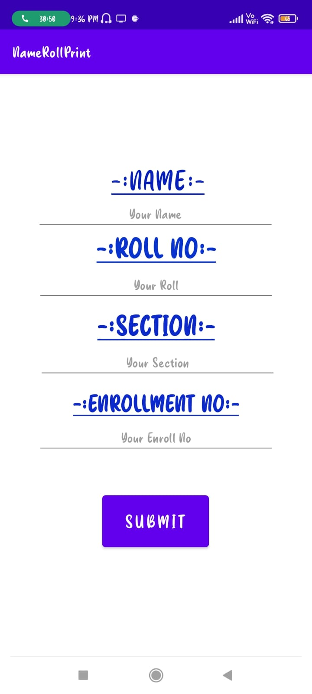
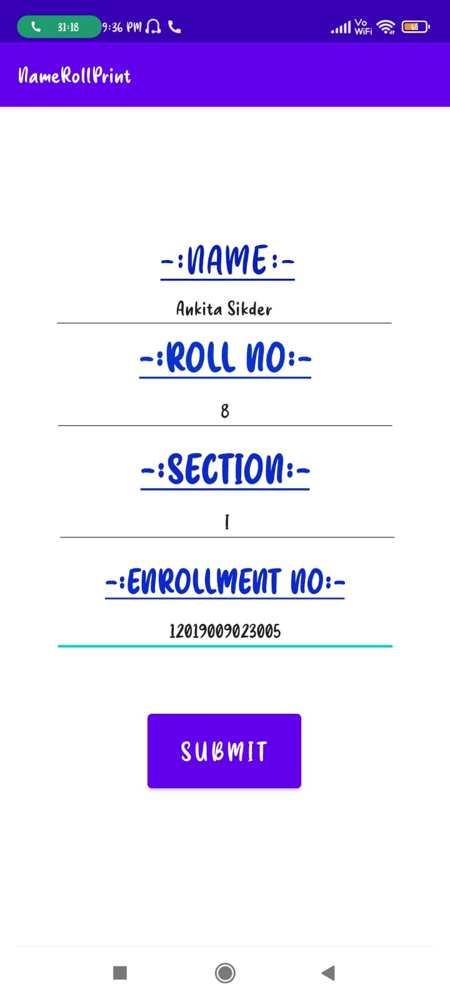

# Name-Roll-Print-ANDROID-APP :star_struck: 

[](https://shields.io/) [](https://shields.io/) [](https://shields.io/) [](https://shields.io/) [](https://shields.io/) [](https://shields.io/) [](https://shields.io/) [](https://shields.io/) 

***This new android application named 'Name-Roll-Print-APP' is created by Biswarup Bhattacharjee, student of BTECH, in University of Engineering and Management, Kolkata.***

**Email Id: bbiswa471@gmail.com.** 

**Contact No: 916290272740.** 

<p align="left">
<a href="https://www.facebook.com/profile.php?id=100070395300810" target="blank"></a>
<a href="https://instagram.com/biswarup2210" target="blank"></a>
<a href="https://github.com/biswa2210/biswa2210" target="blank"></a>
</p>

## About :point_down: 

<div align="justified">
 
This is a simple name roll printing app using java. This is an android app which takes name, roll no., section, enrolment no. from user and prints them in another page. I have made this using java. It is a basic app for practicing the basic of android development.

</div>

## APP DOWNLOAD LINK : :point_right: <a href="https://drive.google.com/file/d/1S_WczSbxSLGaluG4hDFtBjmkRESLf9dP/view" download>Click here to download</a>

## Purpose :point_down:

<div align="justified">
       
I have made this app for practising android development basic. 
 
</div>

## Folder Structure :point_down:
```bash
name-roll-print-app
      └── app
           └── src
                ├── android/java/com/example/namerollprint
                |                             └── ExampleInstrumentedTest.java
                ├── test/java/com/example/namerollprint
                |                             └── ExampleUnitTest.java
                └── main
                      └── java/com/example/namerollprint
                                     ├── MainActivity.java 
                                     └── MainActivity2.java  
 ```                      
## Making :point_down:

<div align="justified">

I have created this app using basic java concepts in android development. I have created two java files for two actvities and two xml files to design them.

</div>


## Screenshots :point_down: 

<div align="center">
  
<a href="pics/n1.jpeg"></a> <a href="pics/n2.jpeg"></a> <a href="pics/n3.jpeg"></a>
 

       
</div>


