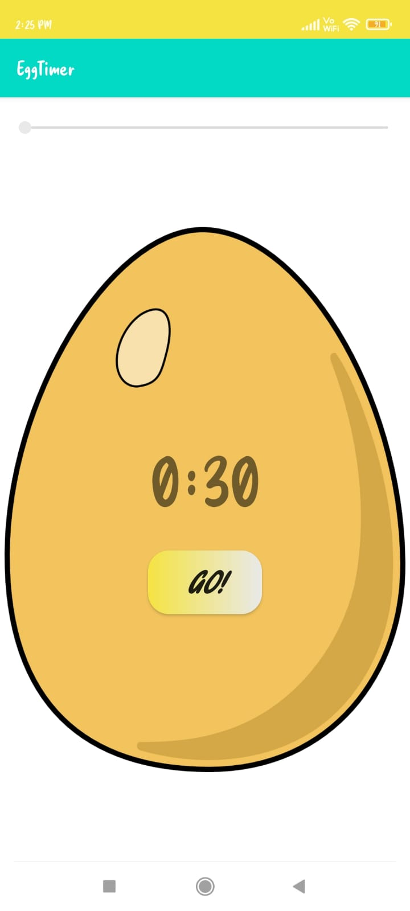
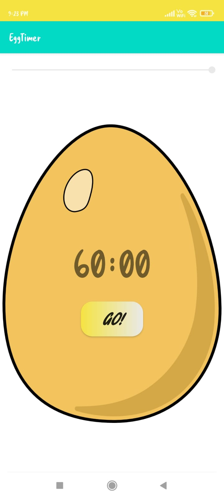

# EGG-TIMER-ANDROID-APP :star_struck: 

[](https://shields.io/) [](https://shields.io/) [](https://shields.io/) [](https://shields.io/) [](https://shields.io/) [](https://shields.io/) [](https://shields.io/) [](https://shields.io/) 

***This new android application named 'EGG-TIMER-APP' is created by Biswarup Bhattacharjee, student of BTECH, in University of Engineering and Management, Kolkata.***

**Email Id: bbiswa471@gmail.com.** 

**Contact No: 916290272740.** 

<p align="left">
<a href="https://www.facebook.com/profile.php?id=100070395300810" target="blank"></a>
<a href="https://instagram.com/biswarup2210" target="blank"></a>
<a href="https://github.com/biswa2210/biswa2210" target="blank"></a>
</p>

## About :point_down: 

<div align="justified">
 
Timer is a specialized type of clock used for measuring specific time intervals. This is a simple egg-timer app using java.  In this app we can set timer upto 60 miutes time. To start the timer we have to click on Go! button and to stop the timer we have to press on stop button. The timer seek is very easy to use. The sound of the timer is of chicken sound. The timer alerts user whenever they want.

</div>

## APP DOWNLOAD LINK : :point_right: <a href="https://drive.google.com/file/d/1svNssIlleC-rxT1DrgBDLsotTEKRrUg_/view" download>Click here to download</a>

## Purpose :point_down:

<div align="justified">
       
I have made this egg timer app so that people easily set a timer whenever they need. 
 
</div>
       
## Importance :point_down:

<div align="justified">

The timer is an important application in Embedded systems, it maintains the timing of an operation in sync with a system clock or an external clock. The timer has so many applications such as measure time generating delays, they can also be used for generating baud rates.
 
</div>

## Folder Structure :point_down:
```bash
egg-timer-app
      └── app
           └── src
                ├──android/java/com/example/eggtimer
                |                             └── ExampleInstrumentedTest.java
                ├── test/java/com/example/eggtimer
                |                             └── ExampleUnitTest.java
                └── main
                      └── java/com/example/eggtimer
                                     └── MainActivity.java  
 ```                      
## Making :point_down:

<div align="justified">

I have created main 3 java files to create this android app. I have created MainActivity.java, ExampleInstrumentedTest.java, ExampleUnitTest.java and created some logics for implementation of this app. 

</div>


## Screenshots :point_down: 

<div align="center">
  
<a href="pics/eg1.jpeg"></a> <a href="pics/eg2.jpeg"></a> <a href="pics/eg3.jpeg"></a>
       
</div>


